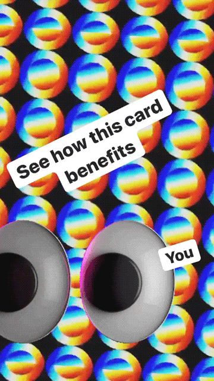
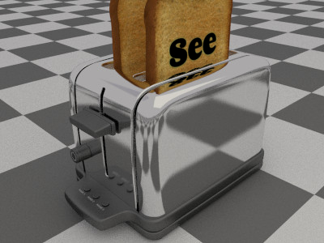

### Overview
People often describe design as "good" or "bad" based on preconditioned biases. Throughout the semester, we&rsquo;ve explored formal qualities of composition and explored the relationship between our intentions and what the physical qualities of our designs are. Control has been a common theme in both the art direction of our projects as well as how we talk about our decisions. Many online tools are considered low quality ways of working for a variety of reasons ranging from the aesthetics, the connotations as well as the limited functionality. Let&rsquo;s embrace this lack of control and see if we can communicate our ideas through these found and free production tools.

### Getting Started
1. Find an email that you would immediately delete without looking at. (Don’t use anything with sensitive information in it. I’m imagining this will be a single page document.)
2. Visually document the email in an honest and direct way (screenshot)
3. Create a text document for steps 3 through 4 (Dropbox paper, google doc, or text edit document). Describe the purpose and physical description of the object in as much unbiased detail as possible.
4. Transcribe all the written information of the mail into one document. If it has images, create an archive of all the images inside of it and save them out as individual assets that you can utilize. Make notes on the hierarchy of the information (what is most important? why?)
5. Write a condensed description of your mail in 280 characters or less. (What is at it’s core?). Start with a few key words and then edit it down to a sentence or two.

### Sketches
Create a poster using one of each of the described methods. Your posters should feel visually unique from one another, but should include a common thread that makes them all feel part of the same series. Some examples of ways of doing this are: Save all entries into a folder that you will submit on Canvas.

#### Instagram Story
1. Using Instagram stories and instagram&rsquo;s native editing features, create 1 poster that highlights the spirit of the email. Consider utilizing collage, text, drawings. While you’re not allowed to design your post in a third party tool (like Photoshop), you can edit photos and save them to your camera roll to then use in the instagram editor. Feel free to edit the content down to the most important aspects of the mail.

#### Desktop Screenshot
2. Using your desktop, assemble a composition that presents the spirit of your email. Use all of the original content in both screenshots. In the first one, try to be as true to the original form as possible. In the second, feel free to edit/replace the assets and see how much of a divergent direction you can create while still housing the same information. Tools to consider: setting a desktop background, using application windows as part of the content (for example, a text edit document, or loading up parts of the photos in preview), using folders to create a collage.

Mindy Seu and Jerome Harris created a similar project, you can see a few examples at the bottom of this <a href="https://docs.google.com/document/d/188MEmnxq7FEot-oVlNaH_mew5ZUs9QTT3srUy2dQSXk/edit?usp=sharing">project page</a>.

#### Cool Text Maker and Google Docs or Dropbox Paper
3. Use [Cool Text Maker](https://cooltext.com/) or [Picasion](https://picasion.com/glitter-maker/) to create a few headlines for your next poster. Using Dropbox paper or Google Docs assemble the poster. Use both the text art you created and the default options in Dropbox Paper or Google Docs.

#### 3D Mock Up Set
6. Choose one rendering from [MakeSweet.com](https://makesweet.com/) and create a set of 5 assets that communicates the idea of your junk mail. For example – if you pick "Flying Flag," you&rsquo;ll have 5 images of the flying flag saved out with different text or images on the rendering. It should be the same rendering in all 5 images.

### Due date
01/24
